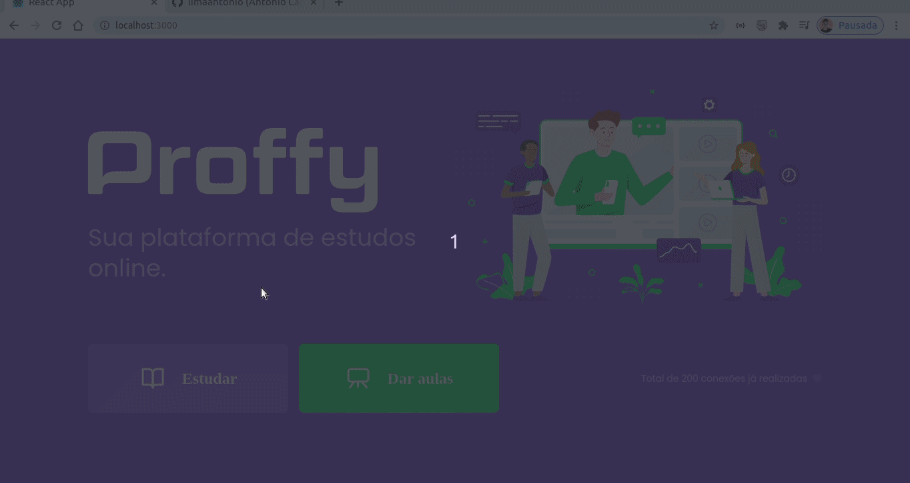

<h1 align="center">
  
</h1>

<h1 display="inline">
  
</h1>

# Indice
- [Sobre](#-sobre)
- [Tecnologias Utilizadas](#-tecnologias-utilizadas)
- [Como baixar o projeto](#como-baixar-o-projeto)

# 🗒 Sobre

O **Proffy** é uma aplicação web desenvolvida durante a **Next Level Week 2.0**. Um treinamento realizado pela **Rocketseat** e que acontece durante o período uma semana.

# 🚀 Tecnologias Utilizadas

- [ReactJS](https://pt-br.reactjs.org)
- TypeScript

# 📦 Como baixar o projeto

```bash

  #Clonar o repositório
  $git clone https://github.com/limaantonio/proffy_front-end
  
  # Entrar no repositório
  $ cd proffy_front-end

  # Instalar as dependencias
  $ yarn install 

  # Inciar o projeto
  $ yarn start

```

Desenvolvido por 💻  Antonio Carlos